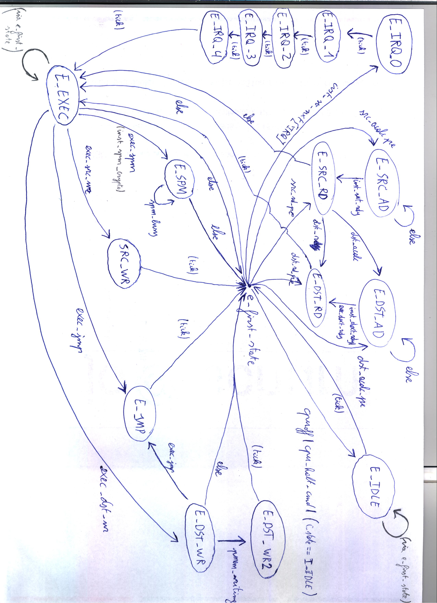
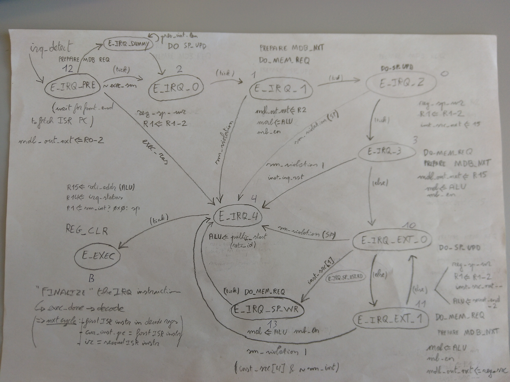

# Largely incomplete and outdated reference docs about the Sancus extensions

## Execution unit state machine

High-level drawing of the original openmsp430 core execution unit state machine
(with an extension to be able to write to ROM):



## IRQ logic description

Some pointers on sancus-core hardware-software contract for secure interruptible enclaves.

### Hardware

Flow is as follows:

* push R15-R4, R2, R0
* read `__sm_sp_addr` from (`sm_secret_end`-2)
* write (R1|0x1) to this address: MSP430 stack pointer is always word-aligned
  so bit0 is never used; we re-use bit0 here to indicate HW IRQ logic wrote R1
  (so we can distinguish `reti_entry` from a normal `ret_entry`)
* clear registers
* put start address of interrupted enclave in R15
* branch to untrusted ISR

**Note (memory access exceptions).** Illegal memory accesses during IRQ logic
will early-out the above process; there's also support for stack overflow
detection -- but let's not consider that for now 

**Note (multithreading).** The idea of having an indirect pointer for the SP
save location (via `__sm_sp_addr`) is there to efficiently support
multi-threaded enclaves which may have more than 1 internal call stack (but
current upstream versions are all single-threaded).

Hardware logic is summarized in the below extensions to the execution unit state machine:



### Enclave runtime (compiler-generated)

Implement support for securely resuming a previously interrupted SM:

* modified linker.py to allocate `__sm_sp_save_loc` and `__sm_sp_save` for every SM
* `sm_entry.S` now initializes `__sm_sp_addr` and enables IRQs
* call `__reti_entry` in `sm_exit.S` to correctly restore execution of a
  previously interrupted module (analogous to the
  existing `__ret_entry`)
* more info on `sm_entry/exit.S` (and a number of unfixed bugs) can also be
  found in my Msc thesis section 3.1.7 and Chapter 5:
  https://distrinet.cs.kuleuven.be/software/sancus/publications/vanbulck15thesis.pdf
* Have for example a look at a minimal (non-secure) asm SM in `sancus-core/core/sim/rtl_sim/src/sancus/sm_irq.s43`:

```
    /* ----------------------         SANCUS MODULE      --------------- */
sm_public_start:
    mov #sm_sp_save, &sm_sp_save_loc
    cmp #0xffff, r4
    jne init_regs

    ; restore interrupted execution context
    mov &sm_sp_save, r1
    clr &sm_sp_save
    repeat pop, r4, r5, r6, r7, r8, r9, r10, r11, r12, r13, r14, r15
    reti
```

### Untrusted operating system scheduler

ISR can easily determine whether an SM was interrupted with `tst r1`, and
should jump to their entry point adhering to the calling convention expected by
`sm_entry.S` (similar to existing `__ret_entry`).

